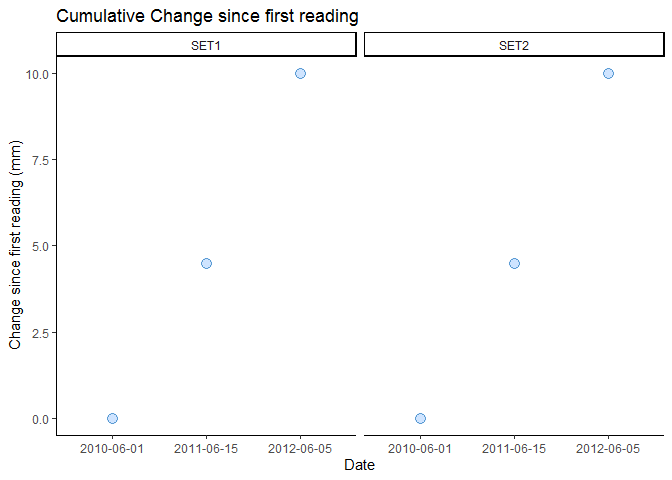
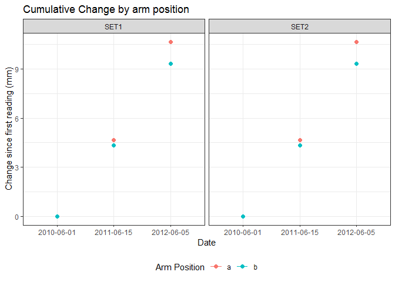

<!-- README.md is generated from README.Rmd. Please edit that file -->

# SETr

<!-- badges: start -->

<!-- badges: end -->

The goal of SETr is to simplify calculations and make graphs for QA/QC
and communication of Surface Elevation Table (SET) data.

## Installation

You can install the development version from
[GitHub](https://github.com/) with:

``` r
# install.packages("devtools")
devtools::install_github("swmpkim/SETr")
```

## Example

This is a basic example which shows you how to make a simple graph of
change since the first reading at each SET:

``` r
library(SETr)

# first, perform cumulative change calculations
cumu_set <- calc_change_cumu(example_sets)

# now plot cumulative change by SET
plot_cumu_set(cumu_set$set)
```



``` r

# or by arm, at a single SET
plot_cumu_arm(cumu_set$arm)
```


