# SETr

If you need to install the `SETr` package, you can use the following
code.

    # install.packages("remotes")
    remotes::install_github("nerrscdmo/SETr")

In this vignette, we will walk through how to use this package to write
your own scripts for the import, analysis, and visualization of Surface
Elevation Table (SET) data. The products from the original NERRS Science
Collaborative-funded [SETr
project](https://nerrssciencecollaborative.org/project/Cressman18) were
designed for users who are not comfortable with R, and only want to have
to hit a few buttons to run an entire workflow process. The current
package is for people who *are* comfortable with R and want to modify or
customize the outputs.

First, load the library.

``` r

library(SETr)
```

## 1. Import data

The assumed format is the wide NERRS format, where each row represents
readings from one SET arm on a given reading date (for a typical SET
with 4 arm positions, there will be 4 rows per date), with one column
for each of the 9 pins’ measurements, and one column for a QA/QC code
per pin. See the [Analysis Tools and Workflow
Guide](https://nerrssciencecollaborative.org/resource/setr-analysis-tools-and-workflow-guide)
for more detail on this data format.

A data file is bundled with this package, and if you’d like to read it
in you can use the following code. Otherwise, you can follow along the
rest of this vignette using the built-in dataset `example_sets_wide`.

You could of course read in your own SET file.

``` r

in_file <- system.file("extdata", "example_wide.xlsx", package = "SETr")
dat <- import_NERRwide(in_file)

# or
# dat <- example_sets_wide
```

Let’s examine this a bit.

``` r

dim(dat)
#> [1] 228  26

length(unique(dat$set_id))
#> [1] 3

length(unique(dat$year))
#> [1] 5
```

This data frame has 228 rows and 26 columns. There are 3 unique SET IDs,
and measurements across 5 unique years.

``` r

head(dat[, 1:9])
#> # A tibble: 6 × 9
#>   set_id  date       year  month day   reserve arm_position arm_qaqc_code
#>   <chr>   <date>     <chr> <chr> <chr> <chr>   <chr>        <chr>        
#> 1 CLMAJ-1 2012-02-29 2012  2     29    GND     1L           <NA>         
#> 2 CLMAJ-1 2012-02-29 2012  2     29    GND     3R           <NA>         
#> 3 CLMAJ-1 2012-02-29 2012  2     29    GND     5R           <NA>         
#> 4 CLMAJ-1 2012-02-29 2012  2     29    GND     7L           <NA>         
#> 5 CLMAJ-1 2012-06-18 2012  6     18    GND     1L           <NA>         
#> 6 CLMAJ-1 2012-06-18 2012  6     18    GND     3R           <NA>         
#> # ℹ 1 more variable: pin_1_height_mm <dbl>
```

Again, each row represents measurements from a single arm of a given SET
on a given date. So for every sample date, at a SET using 4 arm
positions, there are 4 rows of measurements. Each arm should contain 9
pins, and there are columns for pin height and QAQC information for each
of the pins. Additionally, there is a column named `arm_qaqc_code` that
can contain QAQC information for an entire arm. The full list of names
is:

``` r

names(dat)
#>  [1] "set_id"          "date"            "year"            "month"          
#>  [5] "day"             "reserve"         "arm_position"    "arm_qaqc_code"  
#>  [9] "pin_1_height_mm" "pin_2_height_mm" "pin_3_height_mm" "pin_4_height_mm"
#> [13] "pin_5_height_mm" "pin_6_height_mm" "pin_7_height_mm" "pin_8_height_mm"
#> [17] "pin_9_height_mm" "pin_1_qaqc_code" "pin_2_qaqc_code" "pin_3_qaqc_code"
#> [21] "pin_4_qaqc_code" "pin_5_qaqc_code" "pin_6_qaqc_code" "pin_7_qaqc_code"
#> [25] "pin_8_qaqc_code" "pin_9_qaqc_code"
```

### Selecting specific sheets

If you only want to work with one or two SETs, you can specify them.

``` r

dat_2sheets <- import_NERRwide(in_file, sheets = c("CLMAJ-1", "SPALT-1"))
```

Verify that we only read in the two SETs of interest.

``` r

unique(dat_2sheets$set_id)
#> [1] "CLMAJ-1" "SPALT-1"
```

### Excluding sheets

Or, if you have an extra README or other sheet that does not contain SET
data, you can (should!) exclude it. This is just a special case of
selecting sheets, where you select everything but what you don’t want.

In a real case this might be a README, but here, we’ll exclude “SPALT-1”
as an example.

``` r

shts <- readxl::excel_sheets(in_file)
shts_to_exclude <- "SPALT-1"
shts_to_keep <- shts[!(shts %in% shts_to_exclude)]

dat_excluded <- import_NERRwide(in_file, sheets = shts_to_keep)
```

Verify.

``` r

unique(dat_excluded$set_id)
#> [1] "CLMAJ-1"     "JURO_High-1"
```

## 2. Reshape data into long format

The functions used in SETr rely on a long data format: a single pin
reading per row. The function
[`pivot_NERRwide()`](https://nerrscdmo.github.io/SETr/reference/pivot_NERRwide.md)
uses
[`tidyr::pivot_longer()`](https://tidyr.tidyverse.org/reference/pivot_longer.html)
to swing both the height and QAQC column for each pin into a row. So
now, instead of 4 rows per measurement date per SET, we have 36 rows per
measurement date per SET: one row for every individual pin.

``` r

dat_long <- pivot_NERRwide(dat)
```

Now we have fewer columns and many more rows. Let’s look at the
beginning.

``` r

dim(dat_long)
#> [1] 2052   11
```

``` r

head(dat_long)
#> # A tibble: 6 × 11
#>   set_id  date       year  month day   reserve arm_position arm_qaqc_code
#>   <chr>   <date>     <chr> <chr> <chr> <chr>   <chr>        <chr>        
#> 1 CLMAJ-1 2012-02-29 2012  2     29    GND     1L           <NA>         
#> 2 CLMAJ-1 2012-02-29 2012  2     29    GND     1L           <NA>         
#> 3 CLMAJ-1 2012-02-29 2012  2     29    GND     1L           <NA>         
#> 4 CLMAJ-1 2012-02-29 2012  2     29    GND     1L           <NA>         
#> 5 CLMAJ-1 2012-02-29 2012  2     29    GND     1L           <NA>         
#> 6 CLMAJ-1 2012-02-29 2012  2     29    GND     1L           <NA>         
#> # ℹ 3 more variables: pin_number <chr>, height_mm <dbl>, qaqc_code <chr>
```

Some data files use cm rather than mm for their pin measurements, and
these functions were written to allow either. The function
[`height_to_mm()`](https://nerrscdmo.github.io/SETr/reference/height_to_mm.md)
takes either input and returns a data frame with the required names for
downstream functions. Even if your original data was in mm, you need to
run this step because it changes the name of the pin height column.
Notice the names before and after this step.

``` r

names(dat_long)
#>  [1] "set_id"        "date"          "year"          "month"        
#>  [5] "day"           "reserve"       "arm_position"  "arm_qaqc_code"
#>  [9] "pin_number"    "height_mm"     "qaqc_code"
```

``` r

dat_long <- height_to_mm(dat_long)
```

``` r

names(dat_long)
#>  [1] "set_id"        "date"          "year"          "month"        
#>  [5] "day"           "reserve"       "arm_position"  "arm_qaqc_code"
#>  [9] "pin_number"    "qaqc_code"     "pin_height"
```

### Excluding flagged readings

During data collection, individual pin readings are sometimes flagged
and/or coded to indicate issues that might impact the data, for the user
to be aware of. If you would like to exclude any specific information
based on what is in the QAQC column for a pin, you can use the
[`exclude_qaqc()`](https://nerrscdmo.github.io/SETr/reference/exclude_qaqc.md)
function. This will set `pin_height` to `NA` for any reading whose QAQC
code matches one you specify. The example dataset does not have any
associated QAQC flags or codes, but the workflow would look like this:

``` r

dat_qaqc <- example_sets[1:5, ]
dat_qaqc$qaqc_code <- NA
dat_qaqc$qaqc_code[3] <- "LHE"

# all data
dat_qaqc
#>         date set_id arm_position pin_number pin_height qaqc_code
#> 1 2010-06-01   SET1            a      pin_1        100      <NA>
#> 2 2010-06-01   SET1            a      pin_2        106      <NA>
#> 3 2010-06-01   SET1            a      pin_3        118       LHE
#> 4 2010-06-01   SET1            b      pin_1        110      <NA>
#> 5 2010-06-01   SET1            b      pin_2        125      <NA>
```

Note, a message is printed to the console telling you how many readings
were changed to NA. It is in the printed code below between the function
and the printed data frame.

``` r

# excluding suspect pin height
exclude_qaqc(dat_qaqc, codes = "LHE")
#> 1 reading(s) excluded (set to NA) based on QAQC code(s): LHE
#>         date set_id arm_position pin_number pin_height qaqc_code
#> 1 2010-06-01   SET1            a      pin_1        100      <NA>
#> 2 2010-06-01   SET1            a      pin_2        106      <NA>
#> 3 2010-06-01   SET1            a      pin_3         NA       LHE
#> 4 2010-06-01   SET1            b      pin_1        110      <NA>
#> 5 2010-06-01   SET1            b      pin_2        125      <NA>
```

Note, once SWMP-style flagging and coding is official, this will be a
little more complex due to the use of different types of brackets for
flags and codes. These are all special characters to programming
languages and require what’s known as “escaping” so they are evaluated
as characters.

## 3. Make graphs to help QA/QC data

### 3a. Graph raw data

Use this as a QA/QC step - make sure nothing looks wildly out of line
with your expectations or your other data; if it does, go back to your
field sheets and either verify or correct your spreadsheet.

[`plot_raw_pin()`](https://nerrscdmo.github.io/SETr/reference/plot_raw_pin.md)
graphs a single SET, yielding one facet per arm position and one series
of points and lines per pin on each arm.

``` r

plot_raw_pin(dat_long, "CLMAJ-1")
```


You could of course loop through all SETs in the data at once.

``` r

sts <- unique(dat_long$set_id)

for(i in seq_along(sts)){
    print(plot_raw_pin(dat_long, sts[i]))
}
```

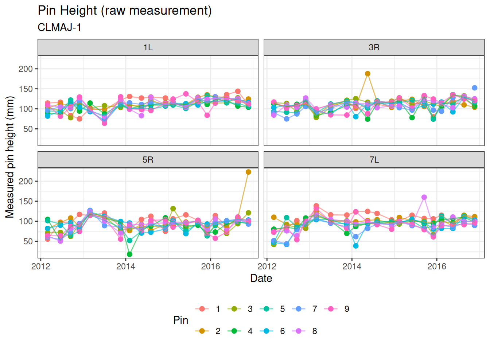

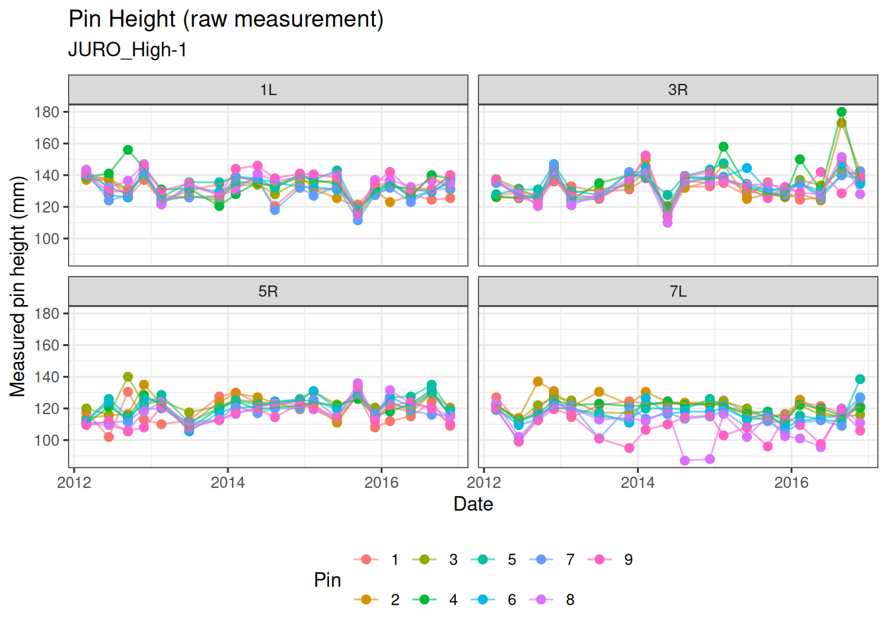

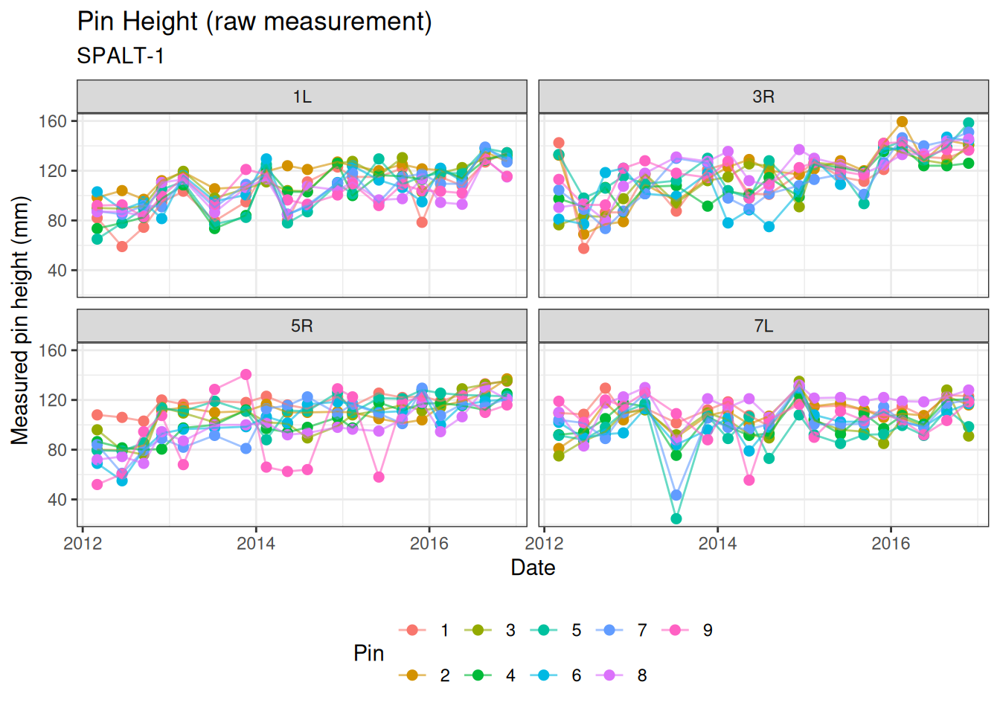

[`plot_raw_arm()`](https://nerrscdmo.github.io/SETr/reference/plot_raw_arm.md)
graphs all SETs in the data, yielding one facet per SET, with each arm
represented as a different color.

``` r

plot_raw_arm(dat_long)
```

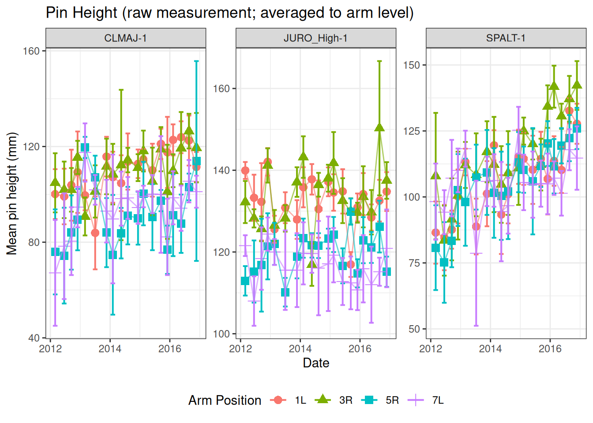

This can get a little crowded depending on how many SETs you have. You
can change the number of columns with the `columns` argument. Let’s try
both 2 columns and 1 column.

``` r

plot_raw_arm(dat_long, columns = 2)
```

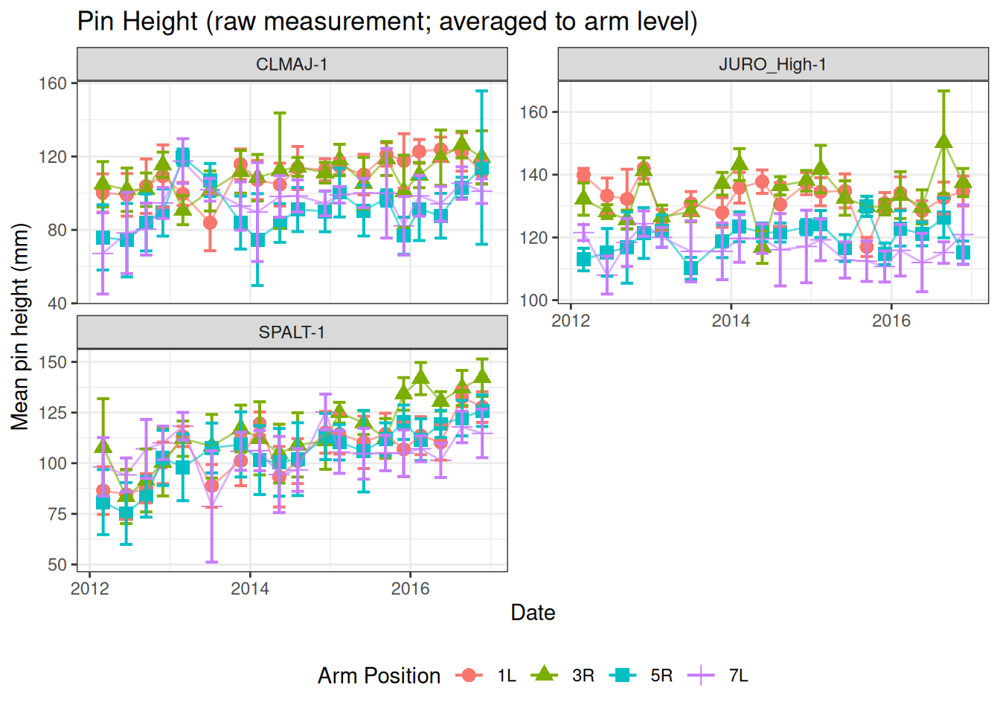

``` r

plot_raw_arm(dat_long, columns = 1)
```

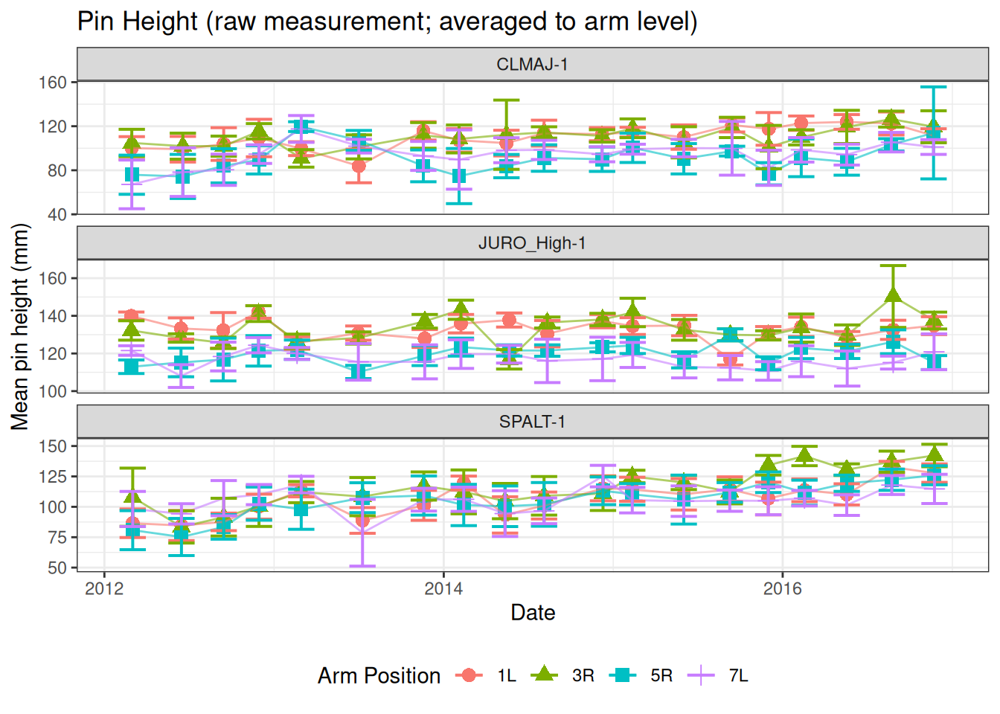

### 3b. Calculate and graph incremental change

A useful QA/QC step is making a graph of change since the previous
reading - if there is a large difference, there could have been a large
deposition or erosion event, or there could be a typo. Either way it is
worth noticing! The `plot_incr_*()` functions put this information on a
graph, with red lines at whatever threshold you specify. First,
incremental change has to be calculated.

[`calc_change_incr()`](https://nerrscdmo.github.io/SETr/reference/calc_change_incr.md)
produces a list: one data frame each for incremental change by pin, by
arm position, and by SET. I’ll illustrate what this looks like on a
smaller example dataset:

``` r

example_incr <- calc_change_incr(example_sets)
str(example_incr)
#> List of 3
#>  $ pin: tibble [36 × 6] (S3: tbl_df/tbl/data.frame)
#>   ..$ date        : Date[1:36], format: "2010-06-01" "2011-06-15" ...
#>   ..$ set_id      : chr [1:36] "SET1" "SET1" "SET1" "SET1" ...
#>   ..$ arm_position: chr [1:36] "a" "a" "a" "a" ...
#>   ..$ pin_number  : chr [1:36] "pin_1" "pin_1" "pin_1" "pin_2" ...
#>   ..$ pin_height  : num [1:36] 100 105 112 106 113 120 118 120 124 110 ...
#>   ..$ incr        : num [1:36] NA 5 7 NA 7 7 NA 2 4 NA ...
#>  $ arm: tibble [12 × 6] (S3: tbl_df/tbl/data.frame)
#>   ..$ set_id      : chr [1:12] "SET1" "SET1" "SET1" "SET1" ...
#>   ..$ arm_position: chr [1:12] "a" "a" "a" "b" ...
#>   ..$ date        : Date[1:12], format: "2010-06-01" "2011-06-15" ...
#>   ..$ mean_incr   : num [1:12] NaN 4.67 6 NaN 4.33 ...
#>   ..$ sd_incr     : num [1:12] NA 2.52 1.73 NA 2.31 ...
#>   ..$ se_incr     : num [1:12] NA 1.45 1 NA 1.33 ...
#>  $ set: tibble [6 × 5] (S3: tbl_df/tbl/data.frame)
#>   ..$ set_id   : chr [1:6] "SET1" "SET1" "SET1" "SET2" ...
#>   ..$ date     : Date[1:6], format: "2010-06-01" "2011-06-15" ...
#>   ..$ mean_incr: num [1:6] NaN 4.5 5.5 NaN 4.5 5.5
#>   ..$ sd_incr  : num [1:6] NA 0.236 0.707 NA 0.236 ...
#>   ..$ se_incr  : num [1:6] NA 0.167 0.5 NA 0.167 ...
```

On the dataset we’re using for the rest of this vignette, the
year/month/day and some qa/qc columns carried through but are
unimportant. So we didn’t need to see them above but are now applying
the incremental change calculation to it.

``` r

dat_incr <- calc_change_incr(dat_long)
```

Now we’ll do some graphing. Functions in this package focus on
incremental change at the pin level - individual pins seem most
susceptible to large changes - and averaged to arm position. You
probably ought to investigate points falling outside your threshold of
interest!

You could use the output from
[`calc_change_incr()`](https://nerrscdmo.github.io/SETr/reference/calc_change_incr.md)
to make your own similar graphs averaged up to SET.

The general threshold of interest for incremental change seems to be 25
mm, so this is the default for where red lines appear in the plot
functions.

At the pin level, you again get one facet per arm position, so you have
to specify a single SET. Here is a graph of incremental change by pin,
with the default threshold of 25. Note, you also have to specify the
data frame within the list, not just the list output of
[`calc_change_incr()`](https://nerrscdmo.github.io/SETr/reference/calc_change_incr.md).

``` r

plot_incr_pin(dat_incr$pin, "CLMAJ-1")
```

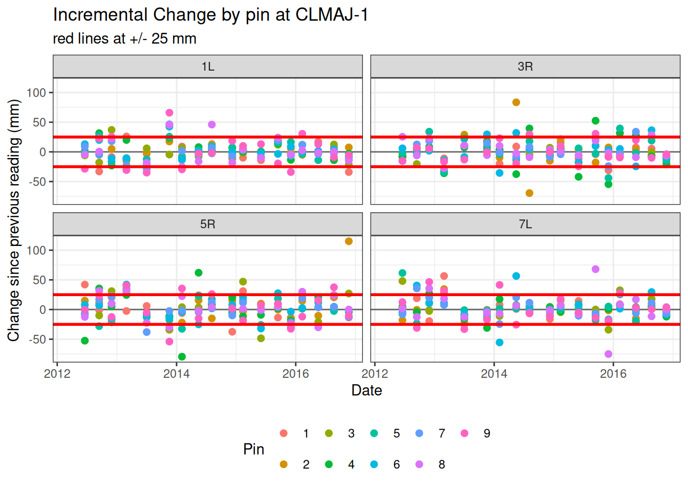

The threshold can be modified with the `threshold` argument:

``` r

plot_incr_pin(dat_incr$pin, "CLMAJ-1", threshold = 75)
```

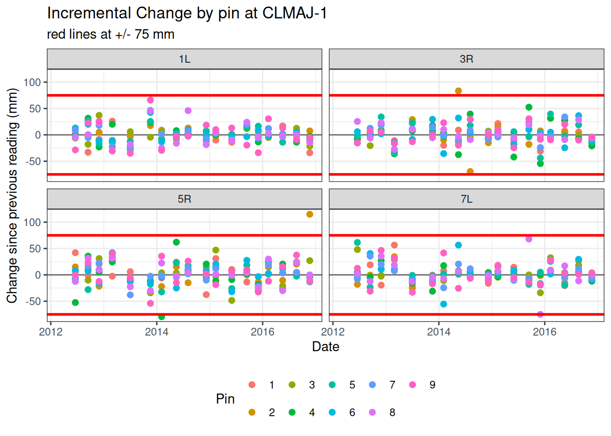

Graphs of incremental change by arm position can be produced for all
SETs. As with the raw data graphing functions, you can change the number
of columns; and as with
[`plot_incr_pin()`](https://nerrscdmo.github.io/SETr/reference/plot_incr_pin.md),
you can change the threshold of interest:

``` r

plot_incr_arm(dat_incr$arm, threshold = 10, columns = 1)
```

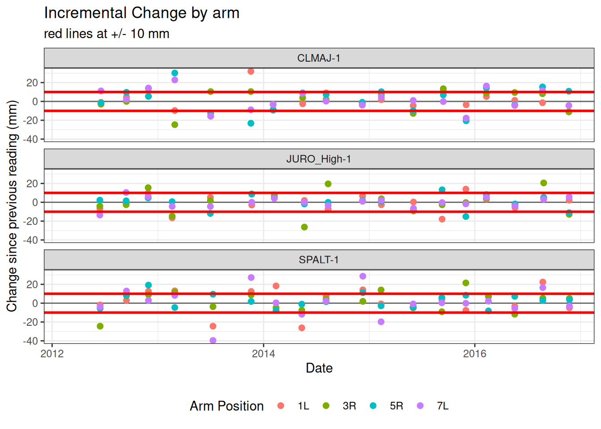

## 4. Calculate and graph cumulative change (change since first reading)

These graphs should look similar to those of raw readings, but all lines
will start at 0. As with
[`calc_change_incr()`](https://nerrscdmo.github.io/SETr/reference/calc_change_incr.md),
[`calc_change_cumu()`](https://nerrscdmo.github.io/SETr/reference/calc_change_cumu.md)
produces a list with data frames for pin, arm position, and SET. The
plotting functions provided here are only for arm and SET, as they seem
to be of more interest than that for individual pins.  
Here is what output looks like for the simplified example data:

``` r

example_cumu <- calc_change_cumu(example_sets)
str(example_cumu)
#> List of 3
#>  $ pin: tibble [36 × 5] (S3: tbl_df/tbl/data.frame)
#>   ..$ date        : Date[1:36], format: "2010-06-01" "2011-06-15" ...
#>   ..$ set_id      : chr [1:36] "SET1" "SET1" "SET1" "SET1" ...
#>   ..$ arm_position: chr [1:36] "a" "a" "a" "a" ...
#>   ..$ pin_number  : chr [1:36] "pin_1" "pin_1" "pin_1" "pin_2" ...
#>   ..$ cumu        : num [1:36] 0 5 12 0 7 14 0 2 6 0 ...
#>  $ arm: tibble [12 × 6] (S3: tbl_df/tbl/data.frame)
#>   ..$ set_id      : chr [1:12] "SET1" "SET1" "SET1" "SET1" ...
#>   ..$ arm_position: chr [1:12] "a" "a" "a" "b" ...
#>   ..$ date        : Date[1:12], format: "2010-06-01" "2011-06-15" ...
#>   ..$ mean_cumu   : num [1:12] 0 4.67 10.67 0 4.33 ...
#>   ..$ sd_cumu     : num [1:12] 0 2.52 4.16 0 2.31 ...
#>   ..$ se_cumu     : num [1:12] 0 1.45 2.4 0 1.33 ...
#>  $ set: tibble [6 × 5] (S3: tbl_df/tbl/data.frame)
#>   ..$ set_id   : chr [1:6] "SET1" "SET1" "SET1" "SET2" ...
#>   ..$ date     : Date[1:6], format: "2010-06-01" "2011-06-15" ...
#>   ..$ mean_cumu: num [1:6] 0 4.5 10 0 4.5 10
#>   ..$ sd_cumu  : num [1:6] 0 0.236 0.943 0 0.236 ...
#>   ..$ se_cumu  : num [1:6] 0 0.167 0.667 0 0.167 ...
```

Now we’ll apply this to the real example data and make a few graphs. As
with the other plotting functions, you can change the number of columns
to suit the number of SETs you are working with.

``` r

dat_cumu <- calc_change_cumu(dat_long)

plot_cumu_arm(dat_cumu$arm)
```

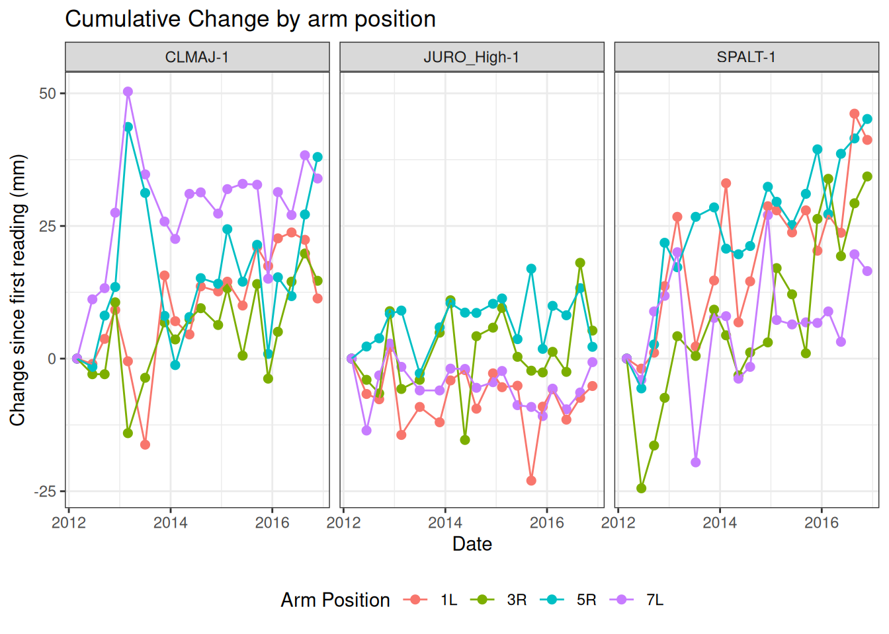

The graph of cumulative change by SET looks a bit nicer, because it is
the simplest SET output to really share. The default graph includes a
linear regression line following SET change. This can be turned off by
setting `smooth = FALSE`, or made skinnier or thicker using the
`lty_smooth` argument (default is 5).

``` r

plot_cumu_set(dat_cumu$set)
```

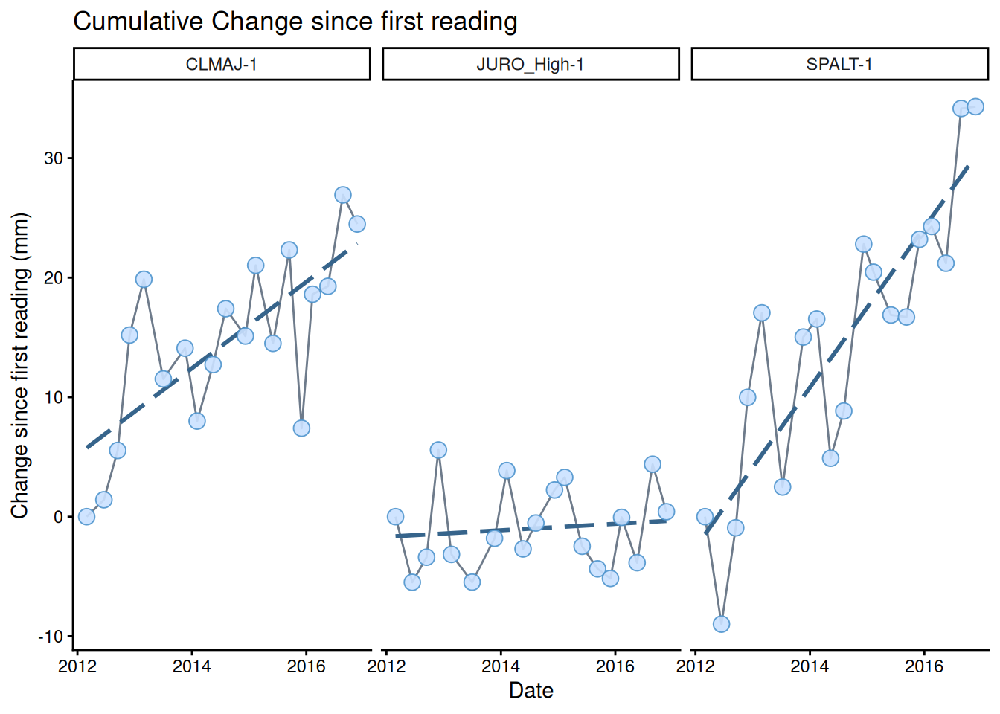

## 5. Calculate the rate of change through time

This step does not use functions from the SETr package, but rather from
your favorite way to model data. In the SETr project, we followed
[Cahoon et al. 2019](https://doi.org/10.1007/s12237-018-0448-x) and used
linear mixed models. [Lynch et al.’s
(2015)](https://pubs.usgs.gov/publication/70160049) protocols explore
linear regression. Also see [Russell et
al. 2022](https://doi.org/10.1007/s10651-021-00524-1) for some
considerations of various approaches.

In general, for this step, you’ll want to generate a rate of change and
a 95% confidence interval for that rate, for each SET.

## 6. Graph change through time

For simplicity, this graph and its variants will be illustrated with
some made up data, rather than performing calculations on the example
data.

``` r

example_rates <- data.frame("set_id" = c("SET1", "SET2", "SET3"),
                            "set_rate" = c(3.2, 4.0, 5.4),
                            "ci_low" = c(3.0, 3.2, 5.2),
                            "ci_high" = c(3.4, 4.8, 5.6),
                            "veg" = c("Spartina", "Juncus", "Distichlis"))
```

Comparing those example rates to a local Sea Level Rise (SLR) rate of
3.5, with a 95% CI of 3.3-3.7: the latter values are all provided via
argument; you have to pull them from elsewhere (we suggest using values
from the nearest NWLON station):

``` r

plot_rate_comps(data = example_rates,
                set_ids = set_id,
                set_ci_low = ci_low,
                set_ci_high = ci_high,
                rates = set_rate,
                comp1 = 3.5,
                comp1_ci_low = 3.3,
                comp1_ci_high = 3.7)
```

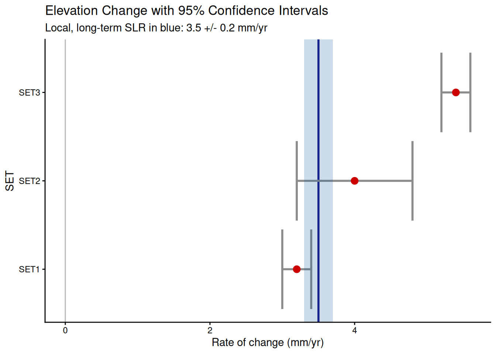

If you would like points to be colored by the dominant vegetation at the
site, and assuming you have joined such information to your calculated
rates, you can do it:

``` r

plot_rate_comps(data = example_rates,
                set_ids = set_id,
                color_by_veg = TRUE,
                set_ci_low = ci_low,
                set_ci_high = ci_high,
                rates = set_rate,
                comp1 = 3.5,
                comp1_ci_low = 3.3,
                comp1_ci_high = 3.7,
                veg = veg)
```

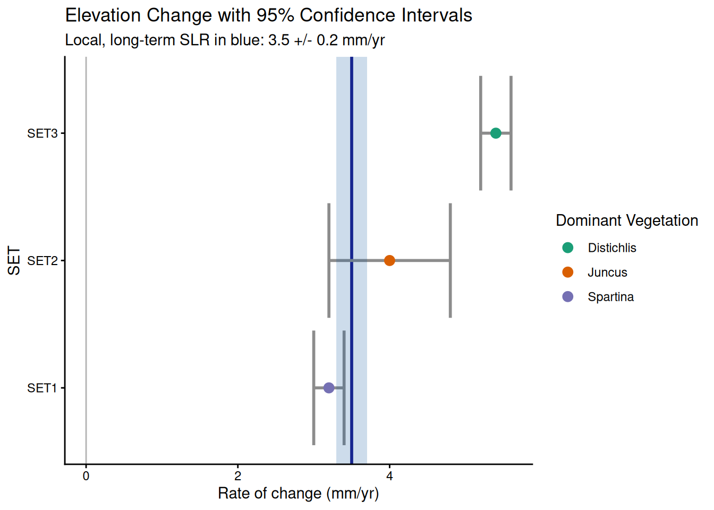

The default colors for the vegetation graph come from RColorBrewer’s
Dark2 scale, which can handle up to 8 categories. If you have more
categories, the color scale will automatically change to viridis:

``` r

# more than 8 vegetation categories -- veg_palette = "auto" (the default)
# switches to a viridis scale automatically instead of running out of Dark2 colors
example_rates_many_veg <- data.frame(
    "set_id" = paste0("SET", 1:10),
    "set_rate" = seq(2, 6, length.out = 10),
    "ci_low" = seq(1.8, 5.8, length.out = 10),
    "ci_high" = seq(2.2, 6.2, length.out = 10),
    "veg" = paste0("Species", 1:10))

plot_rate_comps(data = example_rates_many_veg,
                set_ids = set_id,
                color_by_veg = TRUE,
                set_ci_low = ci_low,
                set_ci_high = ci_high,
                rates = set_rate,
                comp1 = 3.5,
                comp1_ci_low = 3.3,
                comp1_ci_high = 3.7,
                veg = veg)
```

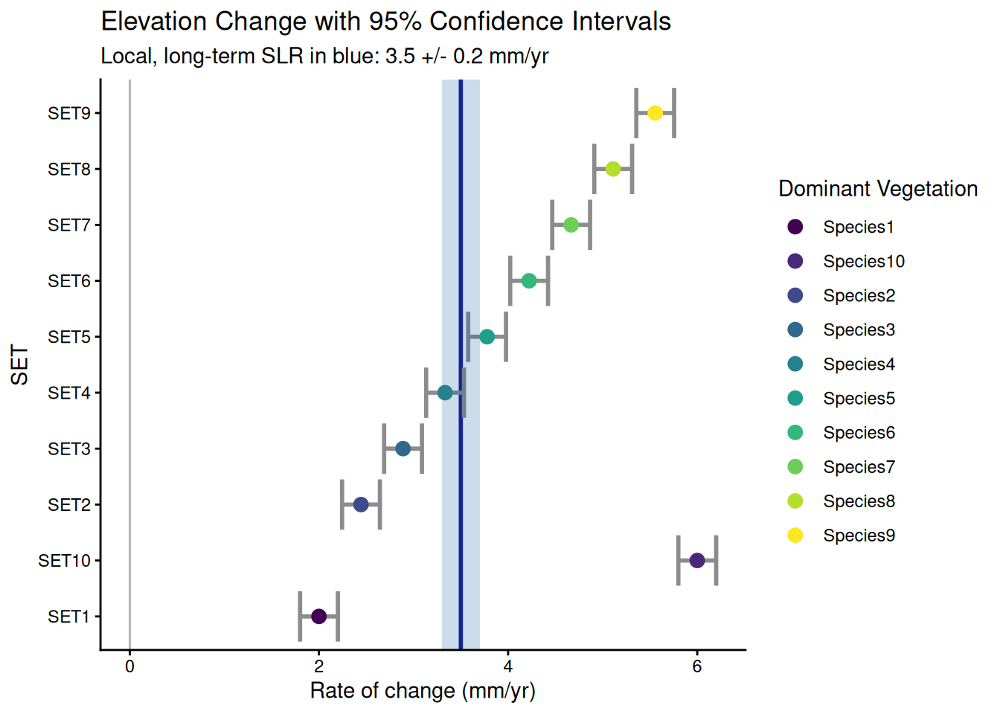

If you know your 19-year water level change rate, you can also add it.
See [this repository](https://github.com/swmpkim/WaterLevels) if you’d
like some help getting the data and performing the calculations for your
NWLON station.

``` r

plot_rate_comps(data = example_rates,
                plot_type = 4,
                set_ids = set_id,
                set_ci_low = ci_low,
                set_ci_high = ci_high,
                rates = set_rate,
                comp1 = 3.5,
                comp1_ci_low = 3.3,
                comp1_ci_high = 3.7,
                comp2 = 5.5,
                comp2_ci_low = 5.0,
                comp2_ci_high = 6.0)
```

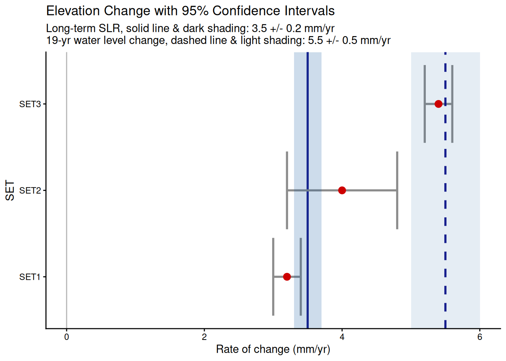

### Sea level rise rates
